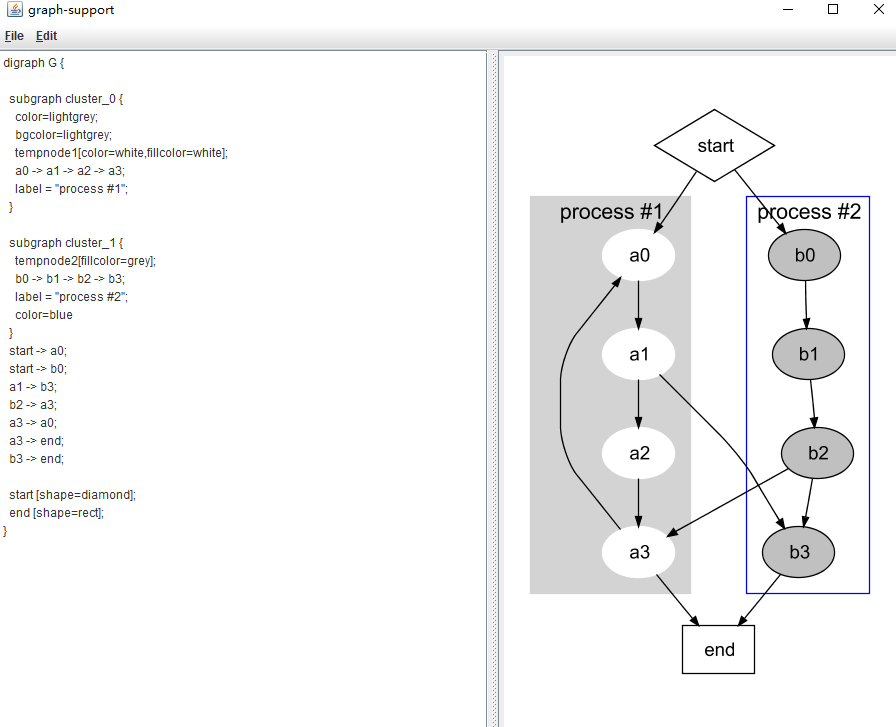

# graph-support-dot-demo

[graph-support](https://github.com/jamisonjiang/graph-support) integrated dot parsing experiments.

## Background

Dot scripts are always easier to write than Java, and [graph-support](https://github.com/jamisonjiang/graph-support) needs a simple **dot parser** to quickly verify its functionality. This project uses [JPGD](http://www.alexander-merz.com/graphviz) as a simple dot parser to complete a [graph-support](https://github.com/jamisonjiang/graph-support) integrated dot demo, mainly for testing.

## Limit

Don't expect too much from it, [JPGD](http://www.alexander-merz.com/graphviz) has a lot of limitations in parsing dots,And some scripts that can be parsed under [graphviz](https://graphviz.org/) usually need to be rewritten to be parsed under [JPGD]( http://www.alexander-merz.com/graphviz).

The following are some commonly used different ways of writing:

| Case           | Graphviz                                                     | JPGD                          |
| -------------- | ------------------------------------------------------------ | ----------------------------- |
| Temporary node | node[...]                                                    | tempnode{id}[...]             |
| Temporary node | edge[...]                                                    | templine{id}[...]             |
| Edge port      | a:w -> c:e                                                   | a->b[tailport=w;headport=e]   |
| Edge cell port | a[label="{<p0>\|<p1>}"]<br/>b[label="{<p2>\|<p3>}"]<br/>a:p0->b:p3 | a->b[tailcell=p0;headcell=p3] |

There are some other restrictions, such as JPGD is best used `;`  split each line and element attributes, otherwise it is easy to report an error.

## Try

Package:

```shell
mvn clean package
```

Run:

```shell
java -jar dot-demo.jar
```

You will see a simple dot editor client:


